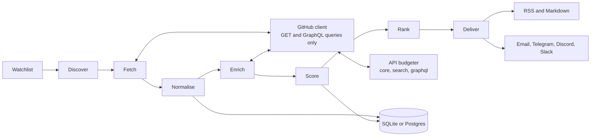

# Architecture

Status: M0. This page describes the target design and marks what exists today.

## Pipeline



| Stage | What it does | Milestone |
| --- | --- | --- |
| Discover and fetch | Per repo: repo, open issues, open PRs, with ETags and a stable sort (ADR 0012) | M1, built |
| Enrich | One `linked:pr` search per repo; comments and timelines for finalists; repo health inputs (ADR 0014) | M2, built |
| Score and rank | Engines run on stored data when asked (ADR 0015) | M2, built |
| Deliver | Digest builder, renderers and channels (ADR 0016) | M3, built |
| Track PRs | Your PRs, their reviews, checks and timeline; status and nudge (ADR 0017) | M4, built |
| Normalise | Store repos, issues, signals and PRs with `user_id` on personal tables | M1 |
| Deliver | Digest renderers and channels | M3 |

## Interfaces

All of these are thin shells over the same core package.

| Interface | Exists today |
| --- | --- |
| CLI (`firstpr`) | `--version`, `doctor` (with `--measure-etag`), `demo`, `watch add/remove/list`, `sync`, `find`, `explain`, `eval sample/run`, `pack list/add/verify`, `digest`, `dismiss`, `snooze`, `init`, `export`, `prs` |
| FastAPI server | M5 |
| React dashboard (`web/`) | Shell that renders demo data with the design tokens |
| Scheduled GitHub Action | M6 |

## Boundaries that matter

- **Only the GitHub client talks to GitHub**, and it refuses writes (ADR 0004).
- **Config holds every limit and weight** (ADR 0005). `firstpr doctor` prints the loaded GitHub limits.
- **Demo data never mixes with real data** (ADR 0008).
- **The product name is in `brand.json`** (ADR 0002). The web app imports the same file.

## Code map (today)

```
src/issueradar/
  brand.json, brand.py     product identity
  cli.py                   Typer app
  config/defaults.yaml     limits, thresholds, weights
  config/settings.py       pydantic schema, loader, friendly errors
  models.py                Tier, Availability, PullRequestStatus, ...
  github/client.py         the only module that sends requests; read-only guard,
                           retries, ETag cache, GraphQL errors in HTTP 200
  github/budget.py         API budgeter per resource, safety margin
  github/guard.py          refuses non-GET REST and GraphQL mutations
  storage/models.py        every table from the brief, user_id on personal ones
  storage/migrations/      Alembic migrations, applied automatically
  sync/service.py          watchlist sync, per-repo transactions, resume
  sync/normalize.py        GitHub JSON to table fields, PR references
  sync/enrich.py           linked:pr search, finalist comments and timelines, health inputs
  sync/single.py           fetch one issue on demand for explain
  engine/                  availability, difficulty, health, stack, ranking, rules
  radar.py                 builds engine inputs from the database; find and explain
  evaluation.py            precision, recall and tier accuracy against your labels
  presets/                 repo rules and starter packs (YAML)
  engine/coach.py          the "before you start" checklist
  digest/                  digest builder, renderers and channels
  delivery/http.py         webhook HTTP for digests; refuses GitHub hosts
  prs/status.py            PR status rules and nudge drafts (pure functions)
  prs/tracker.py           finds your PRs and reads their details
  demo/loader.py           demo dataset schema and loader
  demo/fixtures/demo.json  demo data
web/src/
  styles/tokens.css        design tokens, light and dark
  lib/                     brand and demo data for the web
  components/              level dots, free pill, lists, theme toggle
```
